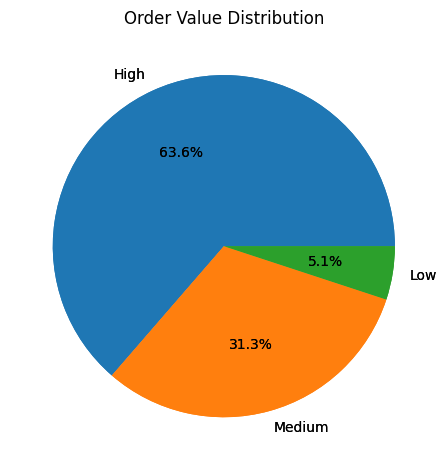

# ETL Midterm Project — Margaret_123

## 1. 📁 Project Overview

This mini-project demonstrates an **ETL pipeline** that extracts sales data, applies meaningful transformations, and loads it into a structured format using Parquet files. The goal is to simulate a real-world data warehousing process that prepares data for efficient analysis.

---

## 2. 🔄 ETL Phases

### Extract (`etl_extract.ipynb`)
- Loaded `raw_data.csv` and `incremental_data.csv`
- Previewed the data with `.head()` and `.info()`
- Noted observations such as missing values, data types, and duplicates
- Saved untouched copies to the `data/` folder

### Transform (`etl_transform.ipynb`)
Applied at least 5 meaningful transformations to both datasets:
- Removed duplicate rows
- Handled missing values using median and mode
- Converted `order_date` to datetime
- Created `total_price` column from `quantity × unit_price`
- Categorized orders into value tiers: Low, Medium, High

Saved outputs to `transformed/` folder as:
- `transformed_full.csv`
- `transformed_incremental.csv`

### Load (`etl_load.ipynb`)
- Loaded the transformed data
- Saved it to efficient **Parquet format** using `pandas.to_parquet()`
- Previewed results using `pd.read_parquet().head()`

Saved files into `loaded/` folder as:
- `full_data.parquet`
- `incremental_data.parquet`

---

## 3. 🛠️ Tools Used

- Python 
- Pandas 
- Jupyter Notebook 
- Parquet via `pyarrow`
- Matplotlib for visualization

---

## 4. 🚀 How to Run the Project

1. Clone or download the repository
2. Open the notebooks in **VS Code** or **JupyterLab**
3. Run the following notebooks in order:
   - `etl_extract.ipynb`
   - `etl_transform.ipynb`
   - `etl_load.ipynb`
4. View the final Parquet files in the `loaded/` folder
5. (Optional) Run the charts to visualize insights

---

## 5. 📸 Screenshot

> Most orders are high-value (63.6%), with medium orders at 31.3% and very few in the low tier. This suggests customers typically spend larger amounts per transaction.

---

